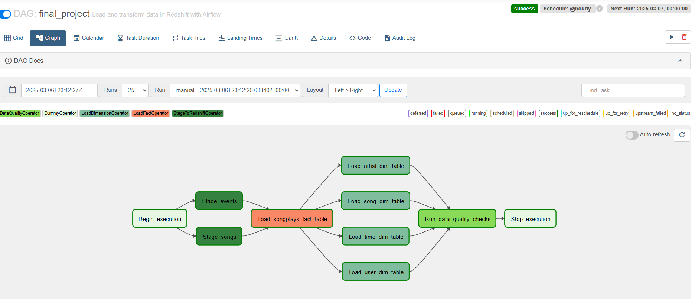

# 🚀 Data Pipeline with Apache Airflow

## 📌 Project Overview  
This project builds an **Apache Airflow ETL pipeline** for Sparkify, a music streaming company. The pipeline automates **staging, transforming, and loading JSON log & song data from S3 into Amazon Redshift**, while ensuring data quality and enabling backfills.

## 🏗️ Project Architecture  
The DAG consists of the following steps:  
1️⃣ **Staging**: Load raw JSON data from S3 into Redshift staging tables.  
2️⃣ **Transform & Load**: Populate fact and dimension tables using SQL transformations.  
3️⃣ **Data Quality Checks**: Run validation queries to ensure data consistency.

### DAG Flow  


## 🛠️ Technologies & Tools  
- **Apache Airflow** → DAG orchestration & monitoring  
- **AWS S3** → Cloud storage for raw data  
- **Amazon Redshift** → Data warehouse  
- **Python** → Airflow operators & custom scripts  
- **SQL** → Data transformations  

## 📁 Project Structure  
```
├── dags/                     # Airflow DAG definition  
│   ├── final_project.py       # Main DAG file  
│     
├── plugins/                  # Custom Airflow operators          
│   ├── stage_redshift.py  
│   ├── load_fact.py  
│   ├── load_dimension.py  
│   ├── data_quality.py  
|
├── create_tables.sql         # Tables Create Statments
|
├── README.md                 # Project documentation  
```

## 🔧 How to Run  
1️⃣ **Clone the repository**  
```bash
git clone https://github.com/AhmedRagab01/Airflow_ETL_Pipeline.git  
cd your-path 
```
2️⃣ **Set up AWS credentials in Airflow connections**  
3️⃣ **Run Airflow Scheduler & Webserver**  
```bash
airflow scheduler & airflow webserver  
```
4️⃣ **Trigger the DAG in the Airflow UI**  

## ✅ Key Features  
✔️ Modular & reusable Airflow operators  
✔️ Handles dynamic timestamps for backfilling  
✔️ Implements **truncate-insert** for dimension tables  
✔️ Runs automated data quality checks  

## 📌 Future Enhancements  
- Add more data quality checks  
- Implement monitoring with Airflow SLAs  
- Extend support for real-time streaming data  

